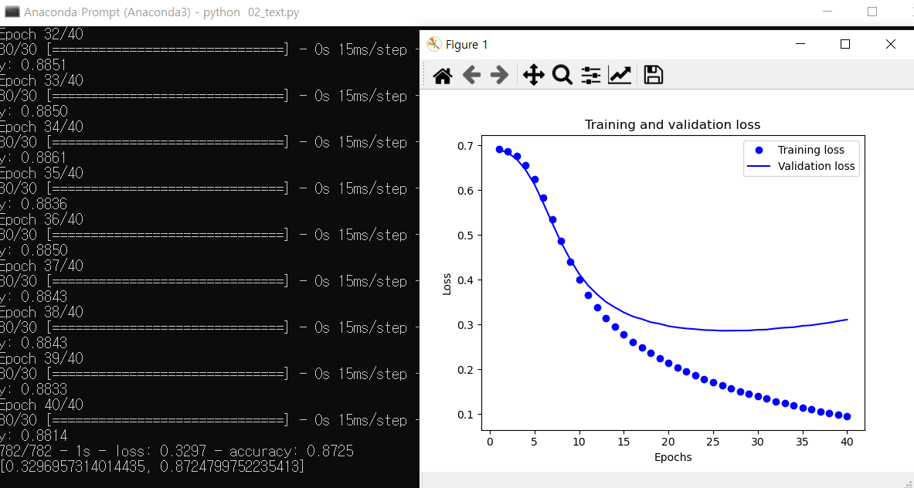
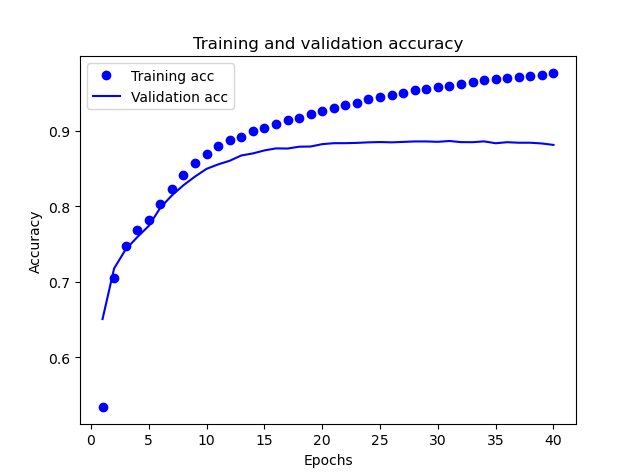

# README

[toc]


## 기본세팅 

아나콘다설치 

CUDA 10.1 설치

CUDnn 7.6.5  설치 

(이게 생각보다 어려움 )

아나콘다 프롬프트에서 

pip install tensorflow

pip install tensorflow-gpu=2.3.0

설치해주기 


## 10-13

가장간단한 코드로 

옷을 보고 이를 구분하는 딥러닝을 구현했다. 

이때 학습을 통해 전체적인 정답률은 개선되었으나 

틀린 것을 계속틀리게 적용하는 문제가 있다 

이를 어떻게 개선할지는 좀더 공부를해보아야겠다. 

기본적인 세팅과 진행이 가능한것까지 확인하였다. 


## 10-19

그다음코드로 txt를 통한 학습을 진행해보았다. 



이런식으로 loss에 대한 함수로 표현할수도 있고 




정확성에 대한 함수로 표현할수도 있었다.


## 모델에 대해 좀더 분석을해보자 

### 이미지

```python
from tensorflow import keras
model = keras.Sequential([
    keras.layers.Flatten(input_shape=(28, 28)),
    keras.layers.Dense(128, activation='relu'),
    keras.layers.Dense(10, activation='softmax')
])
model.compile(optimizer='adam',
              loss='sparse_categorical_crossentropy',
              metrics=['accuracy'])

model.fit(train_images, train_labels, epochs=50)

test_loss, test_acc = model.evaluate(test_images,  test_labels, verbose=2)

```

여기서  케라스 시퀀셜형태에 28x28 자리 이미지를 평탄화시켜 784짜리 1차원행렬로 만든다 

이를 128개의 노드를 가진 층과 10개의 소프트 맥스 노드층을 만들어낸다 이때 소프트맥스 층의 요소들은 10개의 클래스에 대해 해당 이미지가 어떤 모델에 해당할지의 확률을 각각 출력해낸다. 즉 10개 노드에서 나오는 확률을 합치면 1이 된다.   

옵티마이저는 모델의 업데이트 방법을 의미하고 loss는 오차측정  metrics는 모니터링을 위해 사용할 지표를 의미한다. 

이후 fit을 통해 학습을 진행한다 . epochs는 훈련횟수를의미한다. 

이후 evaluate를 통해 테스트를 하는데 이때 훈련때보다 정확도가 낮아진다.  이는새로운데이터를 사용하기 때문에 발생하는 현상으로 이를 과대적합이라고 한다.

### 텍스트

```python
# 입력 크기는 영화 리뷰 데이터셋에 적용된 어휘 사전의 크기입니다(10,000개의 단어)
vocab_size = 10000

model = keras.Sequential()
model.add(keras.layers.Embedding(vocab_size, 16, input_shape=(None,)))
model.add(keras.layers.GlobalAveragePooling1D())
model.add(keras.layers.Dense(16, activation='relu'))
model.add(keras.layers.Dense(1, activation='sigmoid'))

model.compile(optimizer='adam',
              loss='binary_crossentropy',
              metrics=['accuracy'])


x_val = train_data[:10000]
partial_x_train = train_data[10000:]

y_val = train_labels[:10000]
partial_y_train = train_labels[10000:]
history = model.fit(partial_x_train, partial_y_train, epochs=40, batch_size=512, validation_data=(x_val, y_val), verbose=1)

results = model.evaluate(test_data,  test_labels, verbose=2)
```

이는 뭐 비슷한방법이다 Sequential 내부에 인자로 넣어도 되고 add로 추가해도 된다. 

이미지와 다르게 Flatten은 없고 (당연한이야기지만) 대신 Embedding이 추가되었다 

Embedding층은 인코딩된 단어를 입력받고 해당하는 단어에 대한 임베딩 벡터를찾는역할을 수행한다. 

GlobalAveragePooling1D층은  `sequence` 차원에 대해 평균을 계산하여 각 샘플에 대해 고정된 길이의 출력 벡터를 반환합니다. 이는 길이가 다른 입력을 다루는 가장 간단한 방법입니다. 

길이를 같게 만들어주는 층인듯하다 .

16개의 연결된 은닉층이있고 (위에서는 128개) 그리고 마지막으로 sigmoid를 통해 0~1사이의 확률/신뢰도를 출력한다. 