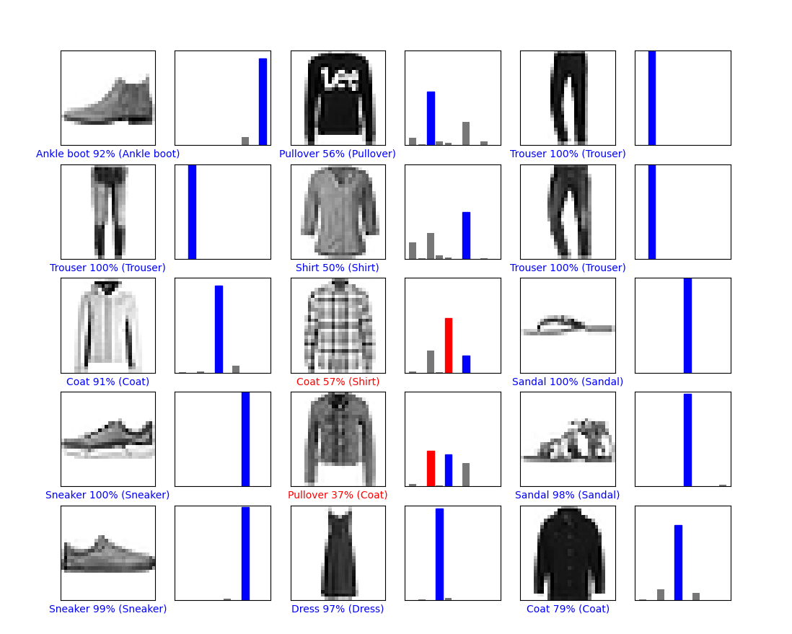
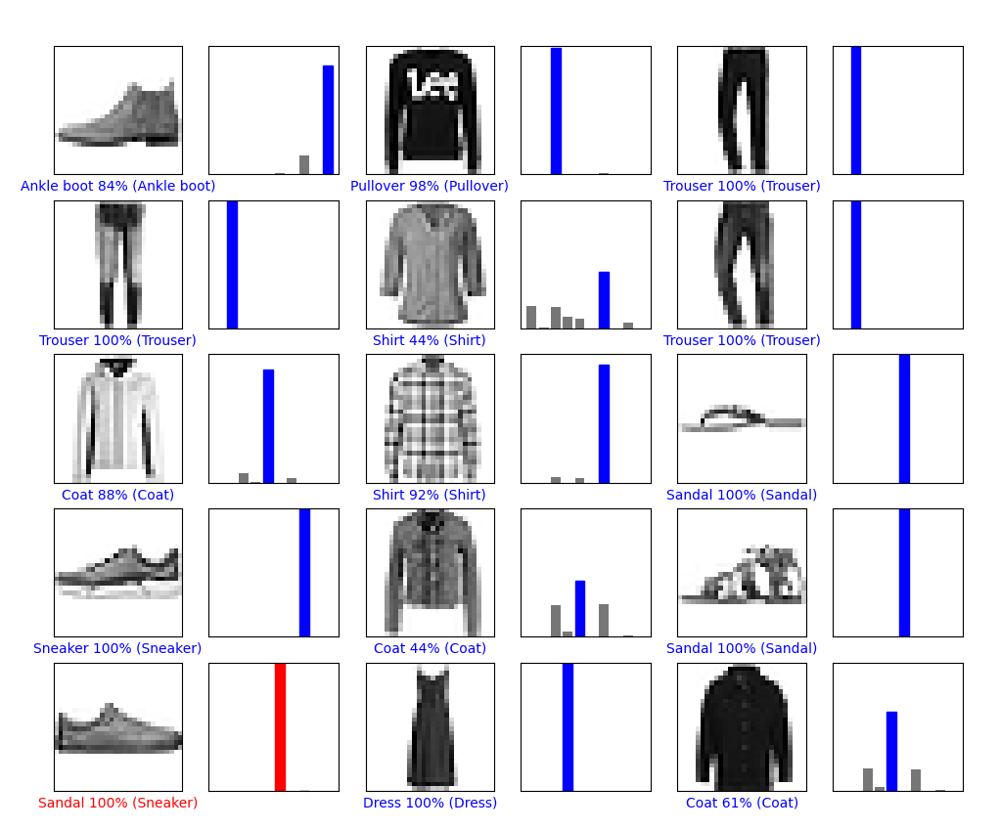

# README

[toc]

## 기본세팅 

아나콘다설치 

CUDA 10.1 설치

CUDnn 7.6.5  설치 

아나콘다 프롬프트에서 

pip install tensorflow

pip install tensorflow-gpu=2.3.0

설치해주기 

## 10-13

가장간단한 코드로 

옷을 보고 이를 구분하는 딥러닝을 구현했다. 

이때 학습을 통해 전체적인 정답률은 개선되었으나 

틀린 것을 계속틀리게 적용하는 문제가 있다 

이를 어떻게 개선할지는 좀더 공부를해보아야겠다. 

기본적인 세팅과 진행이 가능한것까지 확인하였다. 

